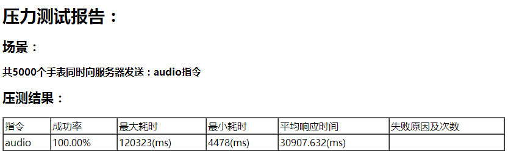
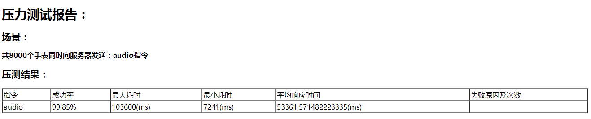
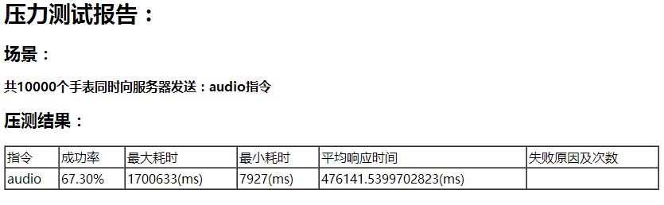
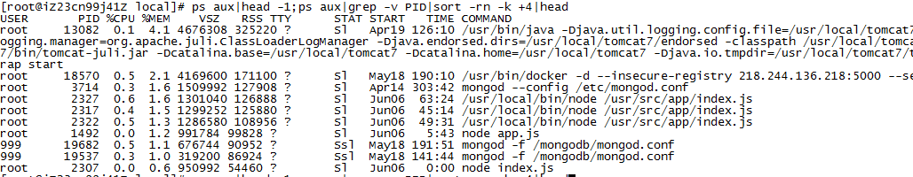

#点联云性能测试报告
##场景1:
- 测试目的:
	* 点联云支持最大在线设备数
- 测试配置:
	* SLB 2台，一台用于tcp服务的转发，一台用于openapi的转发
	* 3台ECS，配置：4核，8G
	* 模拟设备
	* tcp、device均使用nodejs实现
- 测试步骤
	* 首先在两台ECS上均部署tcp服务、第三台ECS上部署模拟设备
	* 打开[测试页面](http://abc/index)，在case1设备数处填入要压测的模拟设备数量，并在期望执行时间处填写期望的压测时间
	* 查看压测报告的邮件
- 测试原理
	* 在测试页面填写设备数与执行时间后，会自动启动一个定时任务，在执行时间触发，定时任务会创建X个到tcp服务器的socket，生成X个模拟设备，每个设备每隔5分钟向tcp服务器发送一次LK指令以保持连接不被关闭，LK指令的发送持续10分钟
	* 同时，每个设备监听从tcp服务器发来的data（LK指令的回复，表明服务器已收到设备发送的LK指令）
	* 当设备收到LK回复后，将对应的socket加入到一个存活数组
	* 每个设备监听socket的close事件，连接关闭时，将socket从存活数组中删除，并不再每5分钟发送LK指令
	* 3小时后，统计存活数组的长度，计算出存活率并邮件出来
- 测试结果
	* 当设备数达到2000时，存活率为100%
	* 当设备数达到4000时，存活率为100%
	* 当设备数达到6000时，存活率为100%
	* 当设备数达到8000时，存活率为100%
	* 当设备数达到10000时，存活率为100%，内存使用率达到94.5%（初始内存使用率为93%）
	* 当设备数达到15000时，存活率为97.55%，内存使用率达到98%（部分设备报错：connection reset）
- 测试结论
	* 线上环境支持10000个在线设备

##场景2:
- 测试目的:
	* 点联云最大指令解析能力
- 测试配置:
	* 2台ECS，配置：4核，4G，空闲内存2.8G，空闲CPU 99.6%，带宽5Mbps
	* 模拟设备，使用nodejs实现
	* tcp服务，使用nodejs实现
	* 设备通过内网向tcp服务器上报语音
- 测试步骤
	* 首先在一台ECS上部署tcp服务、另一台ECS上部署模拟设备
	* 打开[测试页面](http://abc/index)，在case1设备数处填入要压测的模拟设备数量C，并在期望执行时间处填写期望的压测时间，点击“设置”
	* 在case2设备数处填入要压测的模拟设备数量A（A =< C），点击“设置”
	* 查看压测报告的邮件
- 测试原理
	* 在case1稳定后，稳定下来的每个模拟设备向tcp服务器发送语音上报指令，记录每个指令的发起时间，
	* tcp服务器收到上报后，会将数据解析存储并返回确认指令
	* 模拟设备监听data事件，判断为语音上报的确认指令后，用当前时间-发起时间，计算出耗时，并计数，判断计数值是否达到A，达到A后返回并发邮件，如果不能达到A，在0.5小时后返回并发邮件
- 测试结果  
	* 当设备数达到5000时，结果如下：（CPU峰值使用率300%，内存峰值使用率78.3%）
	  

	* 当设备数达到8000时，结果如下：（CPU峰值使用率达到300%，内存峰值使用率达到97%，导致tcp服务异常退出）
	  

	* 当设备数达到10000时，结果如下：（内存峰值使用率100%，引发内存分页管理进程，CPU使用率一直100%，导致tcp服务异常退出）
	  

- 测试结论
	* 线上环境相同配置单台ECS支持5000个在线设备同时上报语音，此时平均响应时间30s
	* 网络环境&带宽也可会成为瓶颈，模拟设备通过公网ip访问tcp服务器时，5000个设备上报指令成功率仅为75%
	* 实际线上tcp服务器剩余内存仅656M，占用内存top 10进程如下
	  
java应用为tour旅游项目，docker服务，node及mongodb

##场景3:
- 测试目的:
	* 点联云最大设备指令下发处理能力
- 测试配置:
	* SLB 2台，一台用于tcp服务的转发，一台用于openapi的转发
	* 3台ECS，配置：4核，8G
	* 模拟设备
	* 模拟客户端
	* tcp、openapi、app、device均使用nodejs实现
- 测试步骤
	* 首先在两台ECS上均部署tcp服务、openapi，第三台ECS上部署模拟客户端（app）和模拟设备
	* 打开[测试页面](http://abc/index)，在case1设备数处填入要压测的模拟设备数量C，并在期望执行时间处填写期望的压测时间，点击“设置”
	* 在case3设备数处填入要压测的模拟设备数量A（A =< C），点击“设置”
	* 查看压测报告的邮件
- 测试原理
	* 在case1稳定后，通过openapi向每个模拟设备发送一条语音、一条message，一条find，一条，记录下每个指令的发起时间，
	* tcp服务器收到上报后，会将指令解析并下发给手表，手表收到指令后响应并返回结果给tcp服务器，tcp服务器将结果返回给openapi
	* openapi收到返回后，用当前时间-发起时间，计算出耗时，并计数，判断计数值是否达到A，达到A后返回并发邮件
- 测试结果
	* 当设备数达到2000时，存活率为XXX
	* 当设备数达到5000时，存活率为XXX
- 测试结论
	* 线上环境支持X个在线设备数

##场景4:
- 测试目的:
	* 点联云单个设备最大指令下发处理能力
- 测试配置:
	* SLB 2台，一台用于tcp服务的转发，一台用于openapi的转发
	* 3台ECS，配置：4核，8G
	* 模拟设备
	* 模拟客户端
	* tcp、openapi、app、device均使用nodejs实现
- 测试步骤
	* 首先在两台ECS上均部署tcp服务、openapi，第三台ECS上部署模拟客户端（app）和模拟设备
	* 打开[测试页面](http://abc/index)，在case1设备数处填入要压测的模拟设备数量C，并在期望执行时间处填写期望的压测时间，点击“设置”
	* 在case4并发数处填入要压测的数量A，点击“设置”
	* 查看压测报告的邮件
- 测试原理
	* 在case1稳定后，通过openapi向一个模拟设备发送A次一条语音、一条message，一条find，一条，记录下每个指令的发起时间，
	* tcp服务器收到上报后，会将指令解析并下发给手表，手表收到指令后响应并返回结果给tcp服务器，tcp服务器将结果返回给openapi
	* openapi收到返回后，用当前时间-发起时间，计算出耗时，并计数，判断计数值是否达到A，达到A后返回并发邮件
- 测试结果
	* 当设备数达到2000时，存活率为XXX
	* 当设备数达到5000时，存活率为XXX
- 测试结论
	* 线上环境支持X个在线设备数