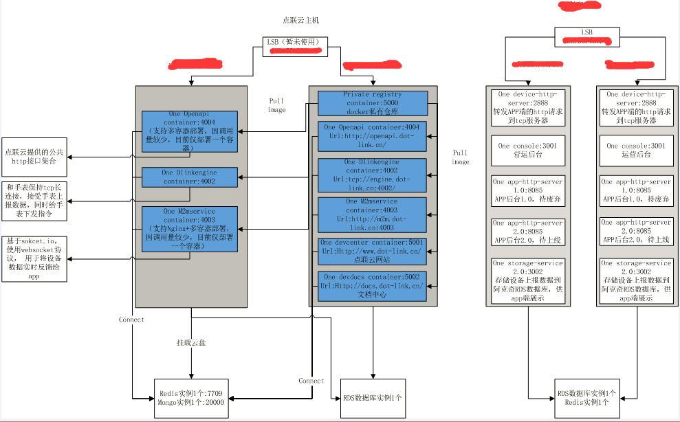
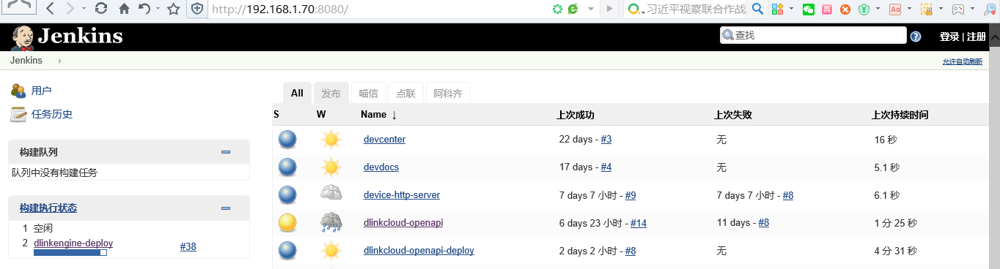
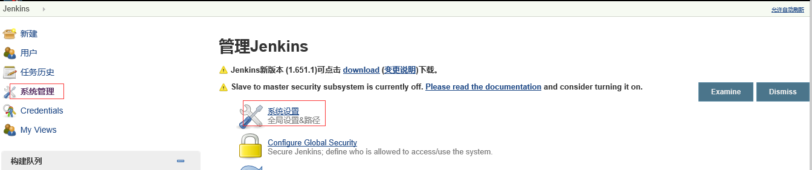
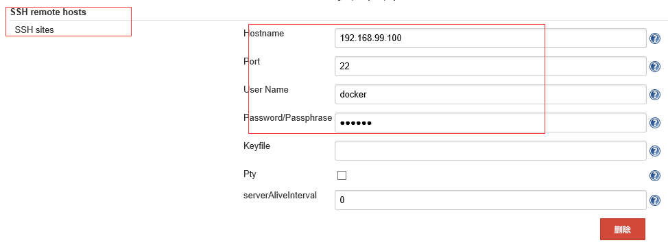
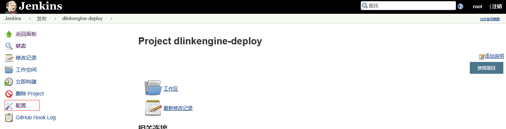
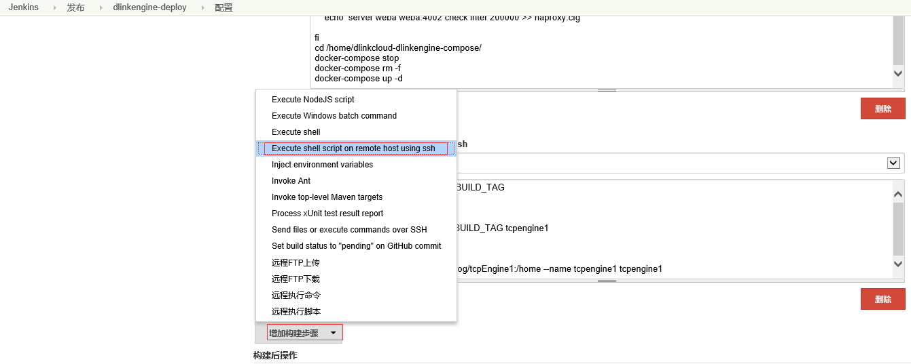
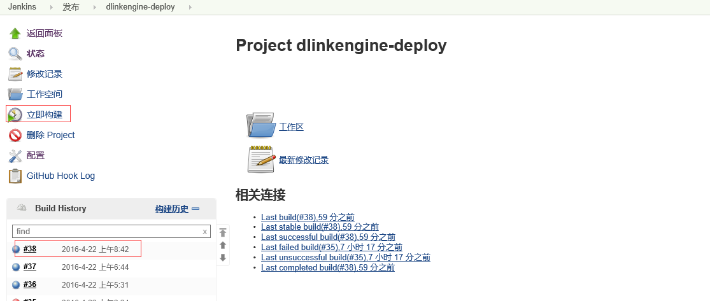
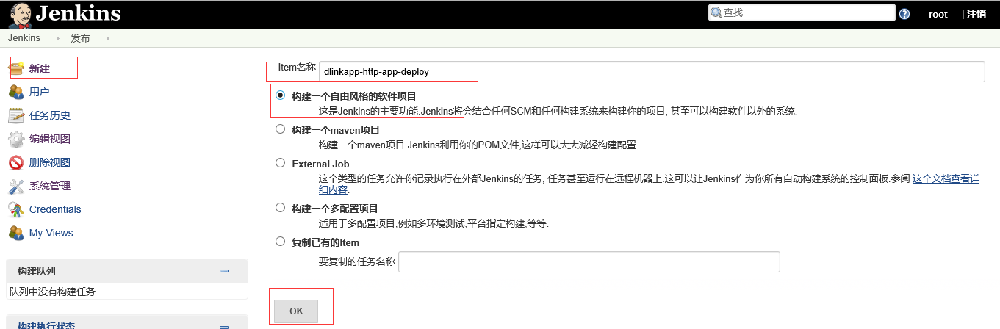
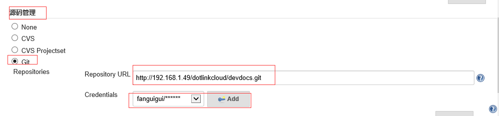

#新服务器安装部署文档

###版本控制
1、2016/4/15 新建，包含docker、docker-compose安装，jenkins工程添加  
2、2016/4/20 新增待部署服务列表&部署架构  
3、2016/4/24 修复错误  
4、2016/4/27 添加redis集群的部署步骤&配置中心的使用  
5、2016/4/28 添加mongodb集群的部署步骤


###环境搭建

####一、docker安装
快速安装：  
1、 `$ yum update`  
2、   
`$ tee /etc/yum.repos.d/docker.repo <<-'EOF'`   
`[dockerrepo]`  
`name=Docker Repository`  
`baseurl=https://yum.dockerproject.org/repo/main/centos/$releasever/`  
`enabled=1`  
`gpgcheck=1`  
`gpgkey=https://yum.dockerproject.org/gpg`  
`EOF`  
3、 `$ yum install docker-engine`，如果此步骤报错：`Failed to set locale, defaulting to C`，执行`$ echo "export LC_ALL=en_US.UTF-8"  >>  /etc/profile`， 然后退出ssh并重新登录，重新执行`$ yum install docker-engine`即可  
4、 `$ service docker start`  
5、 `$ chkconfig docker on`  
6、执行`$ docker ps`，未报错表示docker安装成功   
7、执行 `$ cp -n /lib/systemd/system/docker.service /etc/systemd/system/docker.service`  
`$ sed -i "s|ExecStart=/usr/bin/docker daemon|ExecStart=/usr/bin/docker daemon --insecure-registry=111.111.111.111:5000 --registry-mirror=https://9k6sv4v7.mirror.aliyuncs.com|g" /etc/systemd/system/docker.service`  
`$ systemctl daemon-reload`  
`$ service docker restart`  
8、找到docker 数据目录，一般为/var/lib/docker/下，为避免镜像和容器占用系统盘，可以将此目录挂载到网盘上，具体参考[这里](http://blog.chinaunix.net/uid-20788636-id-4988546.html)


详见[`https://docs.docker.com/engine/installation/linux/centos/`](https://docs.docker.com/engine/installation/linux/centos/) 

####二、redis集群部署  
**需注意，部署完成后，redis客户端初始化代码如下 **   
`var redis = new Redis({`  
`sentinels: [{`  
`host: config.redis_url,`   
`port: config.redis_port }],`  
`name: config.redis_master,`  
`connectTimeout: 1000,`  
`keyPrefix: config.redis_key_prefix,`  
`password: config.redis_password`  
`});`  
`redis_url为sentinel的主机ip，redis_port为sentinel的端口,redis_master为sentinel配置文件中的master1, redis_key_prefix为工程名，会自动添加到key值前以避免出现key冲突`   
1、分别在两台主机上执行`$ docker pull redis`下载redis镜像  
2、在主机A上:  
(a) 执行  
`$ mkdir /home/redis/`    
`$ cd /home/redis/`  
`$ mkdir master`  
`$ cd master`  
`$ touch redis.conf`  
`$ echo port 7709 >> redis.conf`  
`$ echo appendonly yes >> redis.conf`  
`$ echo requirepass password >> redis.conf`  
`$ echo masterauth password >> redis.conf`  
(b) 执行  
`$ docker run -p 7709:7709 -d -v /home/redis/master/redis.conf:/usr/local/etc/redis/redis.conf --name redis-master redis redis-server /usr/local/etc/redis/redis.conf`  
3、在主机B上：  
(a) 执行(将HOSTA替换为主机A的实际ip)  
`$ mkdir /home/redis/`    
`$ cd /home/redis/`  
`$ mkdir slave`  
`$ cd slave`  
`$ touch redis.conf`  
`$ echo port 7709 >> redis.conf`  
`$ echo appendonly yes >> redis.conf`  
`$ echo slaveof HOSTA 7709 >> redis.conf`  
`$ echo requirepass password >> redis.conf`  
`$ echo masterauth password >> redis.conf`  
(b) 执行   
`$ docker run -p 7709:7709 -d -v /home/redis/slave/redis.conf:/usr/local/etc/redis/redis.conf --name redis-slave redis redis-server /usr/local/etc/redis/redis.conf`  
(c) 执行(将HOSTA替换为A的ip)  
`$ mkdir /home/redis/sentinel`  
`$ cd /home/redis/sentinel`  
`$ touch redis.conf`  
`$ echo port 26379 >> redis.conf`  
`$ echo sentinel monitor master1 HOSTA 7709 1 >> redis.conf`  
`$ echo sentinel down-after-milliseconds master1 5000 >> redis.conf`  
`$ echo sentinel failover-timeout master1 900000 >> redis.conf`  
`$ echo sentinel parallel-syncs master1 2 >> redis.conf`  
`$ touch Dockerfile`  
`$ echo FROM redis >> Dockerfile`  
`$ echo COPY redis.conf /home/sentinel.conf >> Dockerfile`  
`$ echo RUN chmod 777 /home/sentinel.conf >> Dockerfile`  
`$ echo CMD [ \"redis-server\", \"/home/sentinel.conf\", \"--sentinel\" ] >> Dockerfile`  
`$ docker build -t redis-sentinel .`  
`$ docker run -d -p 26379:26379 --name redis-sentinel redis-sentinel`  

####三、 mongo集群部署  
1、在hostA执行（假设HOSTA网盘目录/netdisk）  
`mkdir /netdisk/mongo`  
`cd /netdisk/mongo/`  
`mkdir primary`  
`cd primary`  
`mkdir db`  
`touch mongod.conf`  
`echo "port = 27017" >> mongod.conf`  
`echo "dbpath = /data/db" >> mongod.conf`  
`echo "logpath = /data/db/log" >> mongod.conf`  
`echo "journal = true" >> mongod.conf`  
`echo "#replSet = rs0" >> mongod.conf`  
`echo "nohttpinterface = true" >> mongod.conf`  
`echo "logappend = true" >> mongod.conf `  
`echo "#keyFile=/data/db/keyfile" >> mongod.conf`  
`docker run -p 27017:27017 --name mongo-primary -d -v /netdisk/mongo/primary:/mongodb -v /netdisk/mongo/primary/db:/data/db mongo  mongod -f /mongodb/mongod.conf`  
`docker exec -it mongo-primary bash`  
`mongo localhost:27017`  
`use admin`  
```db.createUser( {
    user: "root",
    pwd: "password",
    roles: [ { role: "root", db: "admin" } ]
  });```  
`exit`  
`exit`  
`vi mongod.conf`  
`去掉replSet及keyFile前的#`  
`openssl rand -base64 741 > mongodb-keyfile`  
`docker exec -it mongo-primary bash`  
`chmod 600 /mongodb/mongodb-keyfile`  
`chown -R mongodb:mongodb /mongodb/mongodb-keyfile`  
`exit`  
`docker restart mongo-primary`  
2、在hostB执行（假设hostB网盘目录为/data）  
`mkdir /data/mongo`  
`cd /data/mongo/`  
`mkdir secendary`  
`cd secendary`  
`mkdir db`  
`将步骤1生成的mongodb-keyfile拷贝到当前目录`  
`touch mongod.conf`  
`echo "port = 27017" >> mongod.conf`  
`echo "dbpath = /data/db" >> mongod.conf`  
`echo "logpath = /data/db/log" >> mongod.conf`  
`echo "journal = true" >> mongod.conf`  
`echo "replSet = rs0" >> mongod.conf`  
`echo "nohttpinterface = true" >> mongod.conf`    
`echo "logappend = true" >> mongod.conf`  
`echo "#keyFile=/data/db/keyfile" >> mongod.conf`  
`docker run -p 27017:27017 --name mongo-secendary -d -v /data/mongo/secendary:/mongodb -v /data/mongo/secendary/db:/data/db mongo  mongod -f /mongodb/mongod.conf`  
`vi mongod.conf`  
`去掉keyFile前的#`  
`docker exec -it mongo-secendary bash`  
`chmod 600 /mongodb/mongodb-keyfile`  
`chown -R mongodb:mongodb /mongodb/mongodb-keyfile`  
`exit`  
`docker restart mongo-secendary`  
3、在hostB执行（假设hostB网盘目录为/data）  
`mkdir /data/mongo`  
`cd /data/mongo/`  
`mkdir arbiter`  
`cd arbiter`  
`mkdir db`  
`将步骤1生成的mongodb-keyfile拷贝到当前目录`  
`touch mongod.conf`  
`echo "port = 27018" >> mongod.conf`  
`echo "dbpath = /data/db" >> mongod.conf`  
`echo "logpath = /data/db/log" >> mongod.conf`  
`echo "journal = true" >> mongod.conf`  
`echo "replSet = rs0" >> mongod.conf`  
`echo "nohttpinterface = true" >> mongod.conf`    
`echo "logappend = true" >> mongod.conf`  
`echo "#keyFile=/data/db/keyfile" >> mongod.conf`  
`docker run -p 27018:27018 --name mongo-arbiter -d -v /data/mongo/arbiter:/mongodb -v /data/mongo/arbiter/db:/data/db mongo  mongod -f /mongodb/mongod.conf`  
`vi mongod.conf`  
`去掉keyFile前的#`  
`docker exec -it mongo-arbiter bash`  
`chmod 600 /monodb/mongodb-keyfile`  
`chown -R mongodb:mongodb /monodb/mongodb-keyfile`  
`exit`  
`docker restart mongo-arbiter`  
4、在hostA执行（假设HOSTA网盘目录/netdisk）  
`docker exec -it mongo-primary bash`  
`mongo localhost:27017`  
`use admin`  
`db.auth('root', 'password')`  
```cfg={ _id:"rs0", members:[ {_id:0,host:'HostA:27017',priority:2} , {_id:1,host:'HostB:27017',priority:1}, {_id:2,host:'HostB:27018',arbiterOnly:true}] };```  
`rs.initiate(cfg)`  
`rs.status()`校验集群是否正常  
`exit`  
`exit`  

####四、 docker-compose安装
1、执行$ curl -L https://github.com/docker/compose/releases/download/1.5.2/docker-compose-\`uname -s\`-\`uname -m\` > /usr/local/bin/docker-compose安装docker-compose，如果多次重试仍超时，可以手动下载到本地 [docker-compose](https://github.com/docker/compose/releases/download/1.5.2/docker-compose-Linux-x86_64)，并手动拷贝到 `/use/local/bin`  
2、添加执行权限 `$ chmod +x /usr/local/bin/docker-compose`  

### 待部署服务列表
1、device-http-server #转发APP端的http请求到tcp服务器  
2、console #运营后台  
3、app-http-server #APP后台  
4、storage-service #存储设备上报数据到第三方RDS数据库，供app端展示  

### 部署架构  
  

### jenkins工程新增
1、 打开[jenkins](http://192.168.1.70:8080/)  
  

2、 登录，用户名`root`，密码`password` 
  

3、 (a) 打开`系统管理`>>`系统设置`  
 

(b) `SSH remote hosts`>>`增加`，增加需要发布的线上机器（只需添加一次，如果已存在，则跳过此步）  
 

4、 回到[`首页`](http://192.168.1.70:8080/)，打开`发布`页，查看需要发布的工程是否存在，如果存在且需要做配置变更（如发布到额外的机器）  
(a) 点击进入工程>>`配置`  
 

(b) `添加构建步骤`>>`Execute shell script on remote host using ssh`，选择要发布的线上机器，并填写发布脚本（发布脚本可拷贝其他已存在线上机器的脚本）  

(c) 完成后`保存`>>`立即构建`，可以点击`#38`(具体的构建编号)查看构建日志
 

5、如果步骤4中，`发布`页不存在要发布的工程，则需要手动添加工程，具体为：点击`新建`，进入新建工程页面填写工程信息（注意工程名不能有特殊字符，不要有大写字母，以deploy结尾）  
  

填写完成后点击OK会跳转到具体的配置页面，需要填写的配置项为：  
(a) `源码管理`标签下的`Git`，填写工程github路径&用户名密码  
 
(b) `构建`>>`添加构建步骤`>>`Execute shell script on remote host using ssh`，`SSH site`选择`docker@192.168.99.100:22`(代表测试服务器，此步骤在测试服务器打包工程源码生成docker镜像，并上传到线上服务器的docker私有仓库)，脚本如下(目录名`dlinkcloud-devdocs`、github路径`192.168.1.49/dotlinkcloud/devdocs.git`、github
分支`develop`、端口号`8889`等需要替换)：  
`if [ -d /home/docker/dlinkcloud-devdocs ];  #判断是否存在工程源码目录`  
	`then`  
		`cd /home/docker/dlinkcloud-devdocs #存在，进入工程源码目录`  
		`git pull #从github更新源码`  
`else`  
	`if [ ! -d /home/docker/ ];`   
`then`  
		`mkdir /home/docker/`  
	`fi`  
	`cd /home/docker/`  
`mkdir dlinkcloud-devdocs #新建工程源码目录`  
	`git clone -b develop http\:\/\/fanguigui\:password\@192.168.1.49\/dotlinkcloud\/devdocs.git ./dlinkcloud-devdocs #从github克隆源码到工程源码目录`
`fi`  
`cd /home/docker/dlinkcloud-devdocs #进入工程源码目录`  
`if [ ! -f /home/docker/dlinkcloud-devdocs/Dockerfile ]; then`  
        `touch Dockerfile #新建dockerfile文件，用于构建镜像`  
        `echo FROM node:4-onbuild >> Dockerfile`  
        `echo EXPOSE 8889 >> Dockerfile #暴露端口号`  
`fi`  
`if [-d /Users/appcan_git/dotlinkcloud/configCenter/shandong-skyeye-storage-service ]; then #配置中心是否存在`  
         `rm -f ./config.js #删除默认配置文件`  
         `cp /Users/appcan_git/dotlinkcloud/configCenter/shandong-skyeye-storage-service/config.js ./ #使用配置中心的配置文件`  
`else`   
   `mkdir /Users/appcan_git/dotlinkcloud/configCenter/shandong-skyeye-storage-service #创建配置中心目录`  
   `cp ./config.js /Users/appcan_git/dotlinkcloud/configCenter/shandong-skyeye-storage-service/ #将github中的config.js拷贝到配置中心`  
   `echo 'please edit your config file' #告知需要修改配置中心配置`  
   `exit 100 #退出`  
`fi`  
`docker build -t 111.111.111.111:5000/$BUILD_TAG . #构建镜像`  
`docker push 111.111.111.111:5000/$BUILD_TAG #将镜像推到线上私有仓库`  
(c) `构建`>>`添加构建步骤`>>`Execute shell script on remote host using ssh`，`SSH site`选择要发布的线上机器，填写脚本，示例如下(需替换镜像名、容器名、端口号，如本例中的`devdocs`，端口号 `8889`)：
`docker pull 111.111.111.111:5000/$BUILD_TAG #从线上私有仓库下载镜像`  
`docker rmi -f devdocs #删除上个版本镜像`  
`docker stop devdocs #停止上个版本容器`  
`docker rm devdocs #删除上个版本容器`  
`docker tag 111.111.111.111:5000/$BUILD_TAG devdocs #修改镜像名`   
`docker run -d -p 8889:8889 --name devdocs devdocs #新建并启动容器，将容器端口8889映射到宿主机端口8889`  

(d) 完成后点击`保存`>>`立即构建`  
(e) 初次构建会失败，需要修改[配置中心](http://192.168.1.70:6789/file#)配置为线上配置后，再次点击构建  
6、 构建完成且成功后，需验证服务是否可用。包括  
(a) ssh登录发布机器查看容器是否启动成功，在发布机器上执行命令docker ps，查看对应的工程容器是否在运行，端口号是否正确  
(b) 执行checklist进行上线验证